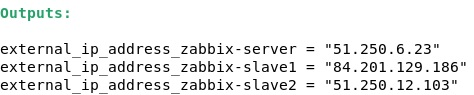
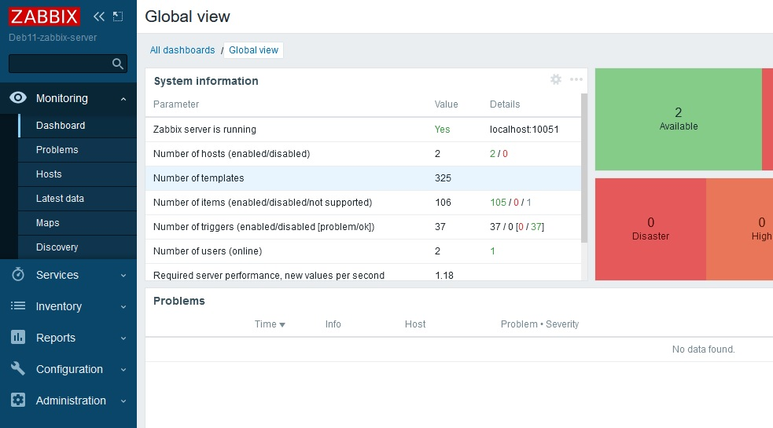
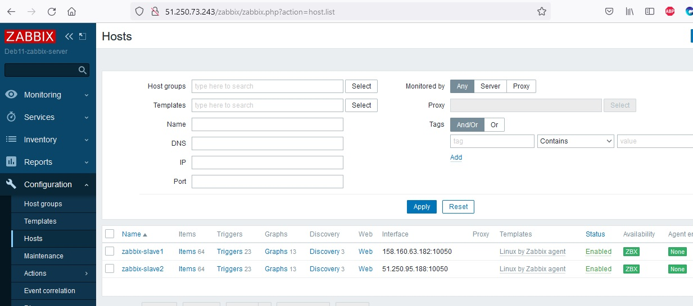
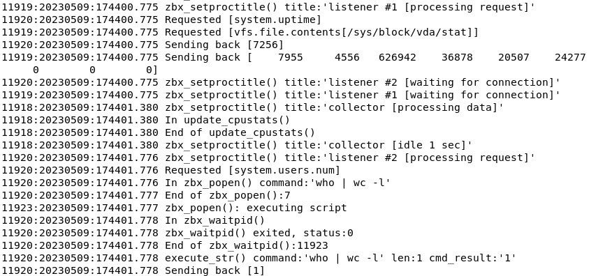
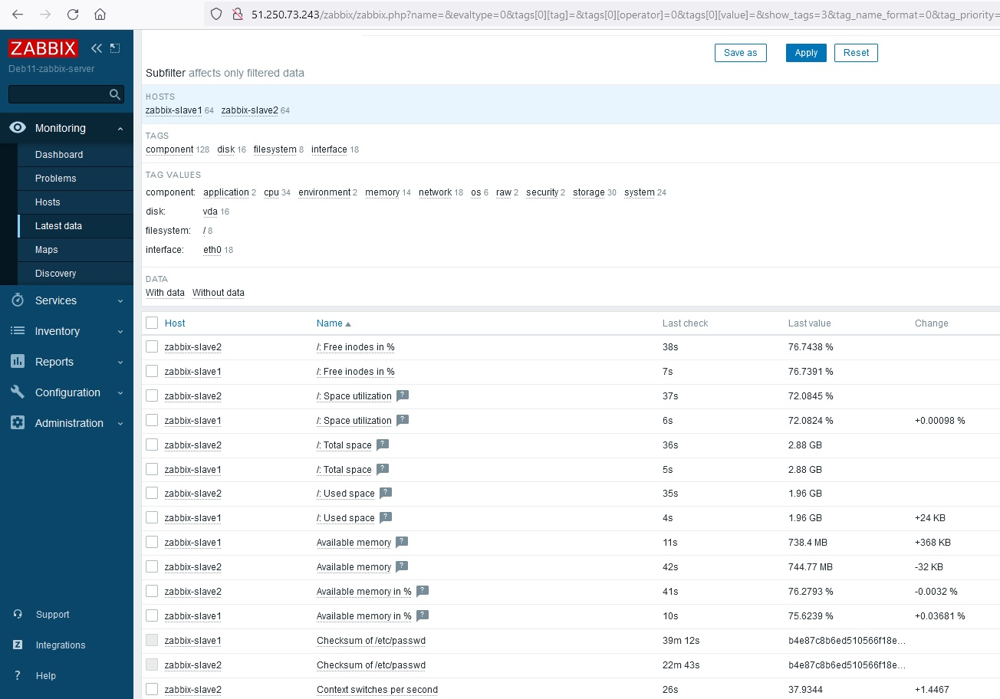
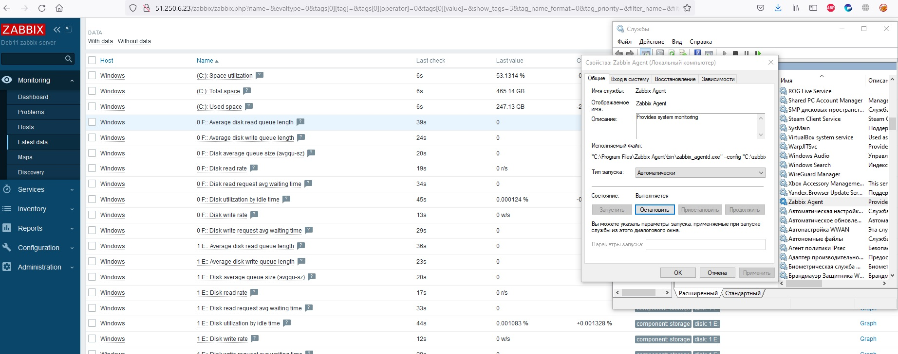

# Система мониторинга Zabbix
## Домашнее задание. Горбунов Владимир

## Цели задания
1. Научиться устанавливать Zabbix Server c веб-интерфейсом
2. Научиться устанавливать Zabbix Agent на хосты
3. Научиться устанавливать Zabbix Agent на компьютер и подключать его к серверу Zabbix 

## Содержание
- [Задание 1. Установка Zabbix c веб-интерфейсом](#Задание-1)
- [Задание 2. Zabbix agent на хостах с linux](#Задание-2)  
- [Задание 3. Zabbix agent на windows](#Задание-3)  

## Задание 1
Установка Zabbix c веб-интерфейсом

- В этом задании решил помимо прочего попрактиковаться с ансиблом, и автоматизировать процесс установки забикса с помощью ансибла и терраформа. 
- Написал плэйбук ансибла для установки забикс-сервера на дебиан 11:

https://github.com/Night-N/8-zabbix1/blob/master/zabbix-server.yml

- Плейбук ансибла для установки забикс-агента на дебиан 11:

https://github.com/Night-N/8-zabbix1/blob/master/zabbix-agent.yml

- Забикс сервер и два сервера с агентами создаются терраформом в яндекс клауде:

https://github.com/Night-N/8-zabbix1/blob/master/main.tf

В итоге терраформом создаются три машины - забикс сервер и две с агентом. С помощью null-resource и команды sed получившиеся внешние IP адреса 
записываются сразу же в инвентарь ансибла ./hosts. 

После чего запускаются плейбуки для server и agent, на забикс агентах с помощью ансибла записывается IP забикс сервера.

- Скриншот админки Zabbix:

## Задание 2
Zabbix agent на хостах с linux
- Агенты, подключенные к серверу:

- Лог заббикс-агента:

- Latest data для двух хостов:

- Забикс агент устанавливается ансиблом, плейбук написан на основе команд с официального сайта Zabbix
https://github.com/Night-N/8-zabbix1/blob/master/zabbix-agent.yml

## Задание 3
Zabbix agent на windows

В соответствии с заданием на мониторинг был поставлен компьютер с windows

Включен режим active, т.к. машина с виндой находится за натом, а проброс портов на роутере было невозможно настроить из-за отстутствия доступа к админке.

- Скриншот с логами windows

